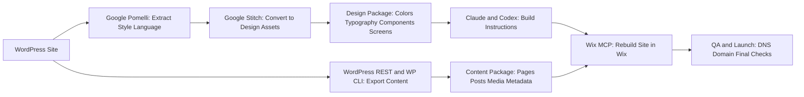
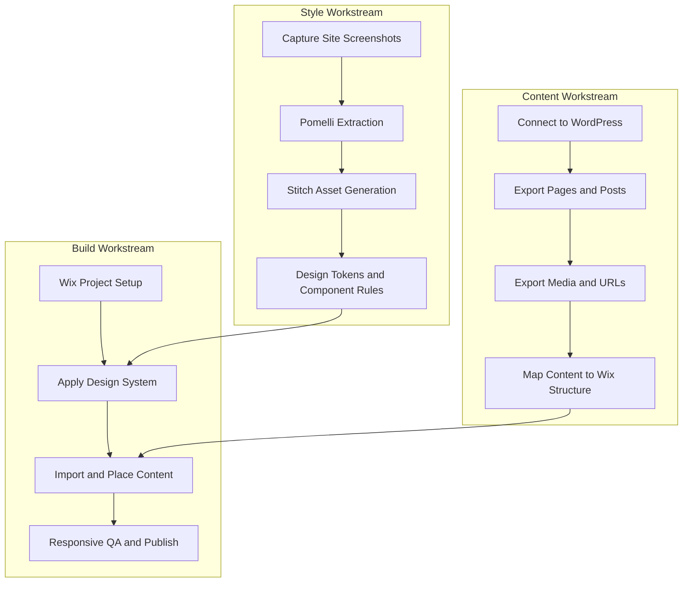

# WP to Wix Migration Plan (Lamicke Yoga)

## 1. End-to-End Flow

## 2. Workstreams

## 3. Tool Stack and Purpose

| Tool | Purpose | Output |
|---|---|---|
| [lamickeyoga.com](https://lamickeyoga.com/) | Source site audit and screenshot reference | Current structure and visuals |
| [Google Pomelli](https://labs.google.com/u/0/pomelli/campaigns) | Extract style/design language | Design language summary |
| [Google Stitch](https://stitch.withgoogle.com/) | Convert visual references into structured assets | Reusable design assets/specs |
| Claude Desktop | Orchestrate rebuild instructions from design assets | Implementation guidance |
| Codex Desktop | Execute technical migration tasks and automation | Structured migration execution |
| WordPress REST + WP-CLI | Export content and metadata from WP | Content export package |
| Wix MCP/Editor | Rebuild website in Wix | Final Wix site |

## 4. Execution Plan (Phased)

### Phase 0: Access and Environment Setup
- Install and sign in: Claude Desktop, Codex Desktop.
- Verify subscriptions and limits for uninterrupted sessions.
- Confirm WordPress admin access and generate Application Password.
- Confirm Wix workspace/project access.

### Phase 1: Discovery and Inventory
- Crawl key WP pages and collect screenshots by template type.
- Build migration inventory for pages, blog posts, media library, menus, forms, and SEO fields.

### Phase 2: Style Extraction
- Run Pomelli on source references to capture design language.
- Send outputs/screenshots into Stitch.
- Produce a style pack with color palette, typography scale, spacing system, and components.

### Phase 3: Content Export from WordPress
- Use WP-CLI/REST to export pages, posts, slugs, dates, media links.
- Normalize content for Wix import/manual placement.
- Create a WP-to-Wix mapping sheet (old URL to new URL, template mapping, media mapping).

### Phase 4: Wix Build
- Create Wix site structure (pages, collections if needed, menus).
- Apply style pack from Stitch outputs.
- Populate content in priority order: homepage, key conversion pages, blog/archive pages, supporting pages.

### Phase 5: QA and Fixes
- Desktop and mobile QA on key templates.
- Validate internal links, media rendering, form behavior, typography consistency, spacing, and alignment.
- Run SEO parity checks for top pages.

### Phase 6: Cutover and Launch
- Prepare DNS/domain switch plan.
- Set redirect rules for changed URLs.
- Final smoke test after publish.
- Monitor first 48 hours for broken links and layout regressions.

## 5. Risks and Mitigation
- **Risk:** Automated style extraction is incomplete.
- **Mitigation:** Manual token cleanup and component-by-component QA.
- **Risk:** WP plugin-specific features do not map to Wix.
- **Mitigation:** Identify in discovery, replace with Wix-native equivalents.
- **Risk:** Auth/access blockers (WP server info, accounts, token limits).
- **Mitigation:** Complete access checklist before migration build starts.

## 6. Definition of Done
- All agreed pages and posts available on Wix.
- Design fidelity accepted by stakeholder review.
- No critical functional issues on desktop/mobile.
- Domain is pointed to Wix and redirect plan is active.
